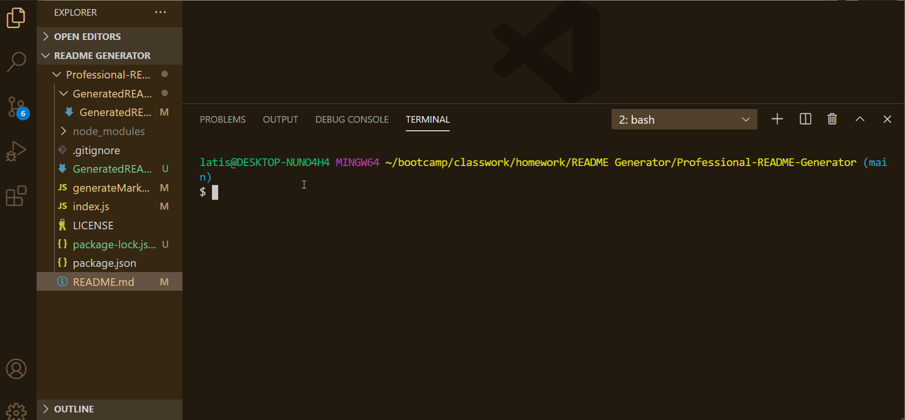

# Professional-README-Generator

# Table of Contents
  1. [Description](#Description)
  2. [Technology Used](#TechnologyUsed)
  3. [Installation](#Installation)
  4. [Instructions For Use](#InstructionsForUse)
  5. [License](#License)
  6. [Screenshot](#Screenshot)
  7. [Questions](#Questions)

DESCRIPTION:
• This is a command line interface (CLI) application that creates a well, structured readme file based on user inputs.

TECHNOLOGY USED:
• JavaScript
• Inquirer
• Node
• Lorem Ipsum Generator (as a filler)

INSTALLATION:
• Fork this repo and clone to your computer. Next, run 'npm install' to install all the dependencies listed in package.JSON file.

INSTRUCTIONS FOR USE:
• Open your terminal and navigate to the root directory of this project. Next, run the command - 'node index.js'. It will prompt you to answer a few questions about your project it will then create a readme file.

LICENSE: 

SCREENSHOT:
• The included image demonstrates the application functionality:

[]

QUESTIONS:
• If you have any questions, concerns or suggestions please feel free to contact me with the link below.
GitHub: https://github.com/lmmccullum
